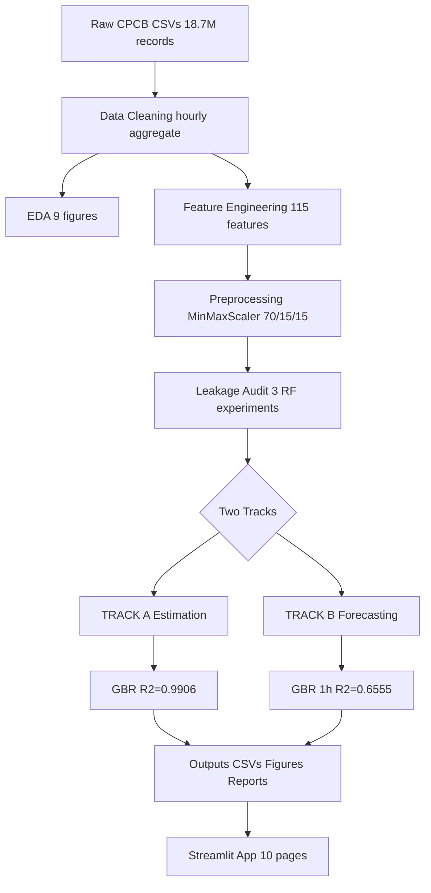

# System Architecture

## Pipeline Diagram



## Data Flow
```
Raw CSV → Cleaned Parquet → Engineered Parquet → Recovered Parquet
         (hourly, AQI)       (115 features)        (imputed, AQI-free)
                                                         |
                                MinMaxScaler (train-fit only)
                                         |
                          Track A ───────┴─────── Track B
                       (same-t feats)         (lag feats only)
                             |                       |
                     model_metrics.json ← both tracks
                             |
                       Streamlit App
```
